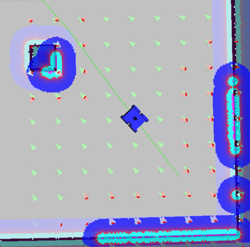

# APF-DWA Hybrid Local Planner

A ROS-based local path planning solution that combines Artificial Potential Fields (APF) with Dynamic Window Approach (DWA) fallback for robust autonomous navigation.

##  Overview

This project implements a hybrid local planner that addresses the classic local minima problem in APF-based navigation. The system intelligently switches between APF and DWA algorithms to ensure reliable path execution in cluttered or narrow environments.

### Key Features

- **Hybrid Architecture**: Seamlessly combines APF efficiency with DWA robustness
- **Local Minima Detection**: Automatic detection of stuck states using movement thresholds
- **Intelligent Fallback**: Dynamic switching to DWA when APF encounters local minima
- **Real-time Visualization**: Interactive force field visualization in RViz
- **ROS Integration**: Full compatibility with ROS navigation stack


### Hybrid Strategy

1. **Primary Navigation**: Uses APF for efficient goal-seeking
2. **Stuck Detection**: Monitors robot movement over time
3. **Fallback Activation**: Switches to DWA when local minimum detected
4. **Recovery**: Returns to APF after successful escape


## Visual Results

The system provides real-time visualization of:
- 🟢 **Green Arrows**: Attractive forces toward goal
- 🔴 **Red Arrows**: Repulsive forces from obstacles

<p align="center">
  
</p>


## Obstacle Avoidance Demonstration
<p align="center">
  
</p>


## Prerequisites

- ROS Noetic
```bash
sudo apt-get update

sudo apt-get install ros-noetic-navigation

sudo apt-get install ros-noetic-amcl
```

## Running Instructions
To run a demo of the robot implementing the custom planner, use the following commands:

**Step 1:** Clone the Project
```bash
git clone https://github.com/abdullaxahmed/APF_DWA_fallback.git

cd APF_DWA_fallback
```
**Step 2:** Build the Workspace
```bash
catkin_make
```
**Step 3:** Sourcing the Workspace
```bash
source devel/setup.bash
```
**Step 4:** Launching the Project

```bash
roslaunch mybot all.launch
```

**Step 5:** Select the following marker topic in RViz in the marker array field

```bash
/move_base/APFLocalPlannerROS/vector_field
```

## APF Parameters

Key parameters in `src/mybot/params/apf_local_planner_params.yaml`:

```bash
# APF Parameters
k_att: 1.0              # Attractive gain
k_rep: 100.0            # Repulsive gain
influence_dist: 1.0     # Obstacle influence radius
robot_radius: 0.2       # Robot collision radius

# Velocity Limits
max_linear_vel: 0.3     # Maximum linear velocity
max_angular_vel: 1.0    # Maximum angular velocity

# Fallback Parameters
use_dwa_fallback: true  # Enable DWA fallback
stuck_dist_thresh: 0.01 # Movement threshold for stuck detection
fallback_duration: 5.0  # Duration to use DWA after stuck detection
```


